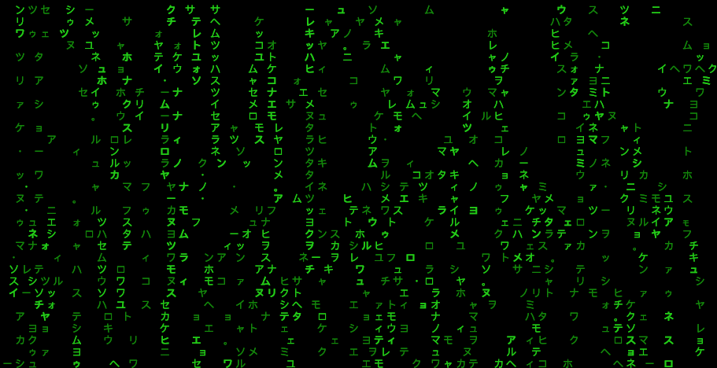

# MatrixJP – Japanese Matrix Rain in Terminal

MatrixJP is a lightweight script that creates a **Matrix-style “digital rain” effect** in your terminal using Japanese characters (half-width or full-width Katakana).

## ✨ Features
- Runs directly in any terminal with Python 3 (macOS/Linux).  
- Runs on Windows with a standalone PowerShell script.  
- Uses **Katakana characters** (half-width by default, optional full-width).  
- Adjustable speed and tail length.  
- Quits cleanly with `q` or `Esc` (Python) or `Ctrl+C` (PowerShell).  
- Works on macOS (M1/M2), Linux, Windows 10/11 terminals.

---

## 🚀 Installation

Clone or copy this repo:

```bash
git clone https://github.com/spaceshiptrip/matrixjp.git
cd matrixjp
````

No external dependencies are required beyond Python 3 (for macOS/Linux).
For Windows, just use the provided PowerShell script.

---

## ▶️ Usage (macOS/Linux)

Run with default half-width characters (best compatibility):

```bash
python3 matrixjp.py
```

Run with **full-width Japanese characters**:

```bash
python3 matrixjp.py --full
```

Quit at any time by pressing **q** or **Esc**.

---

## ▶️ Usage (Windows PowerShell)

Use the included `matrixjp.ps1` script:

```powershell
powershell -ExecutionPolicy Bypass -File .\matrixjp.ps1
```

Quit at any time with **Ctrl+C**.

### 🔧 Options

The PowerShell script supports runtime parameters for optimization:

* `-DelayMs <int>` → frame delay in milliseconds (lower = faster).
* `-TailLen <int>` → trail length (higher = longer streaks).
* `-ClearEveryN <int>` → how often to clear the screen buffer:

  * `1` → clear every frame (**no artifacts**, cleanest).
  * `5` → clear every 5th frame (less flicker, minor trails).
  * `0` → never clear (fastest, may leave artifacts).
* `-ColStep <int>` → draw every Nth column (e.g. `2` = skip every other column for speed).

### ⚡ Examples

Run at high speed, clear every frame (recommended clean look):

```powershell
powershell -ExecutionPolicy Bypass -File .\matrixjp.ps1 -ClearEveryN 1 -DelayMs 5 -TailLen 6
```

Run smoother with less clearing (every 5 frames):

```powershell
powershell -ExecutionPolicy Bypass -File .\matrixjp.ps1 -ClearEveryN 5 -DelayMs 8
```

Fastest mode, no clears (may leave artifacts):

```powershell
powershell -ExecutionPolicy Bypass -File .\matrixjp.ps1 -ClearEveryN 0
```

Skip columns to improve performance on wide terminals:

```powershell
powershell -ExecutionPolicy Bypass -File .\matrixjp.ps1 -ClearEveryN 1 -ColStep 2
```

---

## 🛠️ Tips

* For best results, set your terminal font to a CJK-capable monospaced font, e.g. **Noto Sans Mono CJK JP**.
* Make sure your terminal is set to **UTF-8 encoding**.
* To adjust the effect:

  * **Python version** → edit `time.sleep()` and `tail` in `matrixjp.py`.
  * **PowerShell version** → pass `-DelayMs`, `-TailLen`, `-ClearEveryN`, or `-ColStep` at runtime.

---

## 📸 Demo



---

## 📜 License

MIT License — feel free to modify and share.


